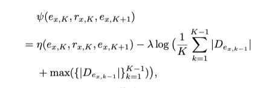

**Data Poisoning Attack against Knowledge Graph Embedding**

The first paper to do targeted adversarial attack on KGE models like TransE, TransH.Due to the sparsity of relations in Knowledge Graph, the paper attacks the entity in KG.

Make $\epsilon$ pertubation on the tuple in KG and aim to make the greatest decrease of the score function on the tuple $f(e_t,r,e_r)$.

In order to make the perturbation on the target entity, the author purposes two ways to do the attack.

*  Direct Attack -- Add / Delete the tuple including the target entity

* Indirect Attack -- Add / Delete the tuple including the neighbouring entity of the target tuple in order to spread the influence of the neighbour tuple to the target tuple.
* Construct a score function to choose the best path of neighborhood and the best choice for adding and deleting.

